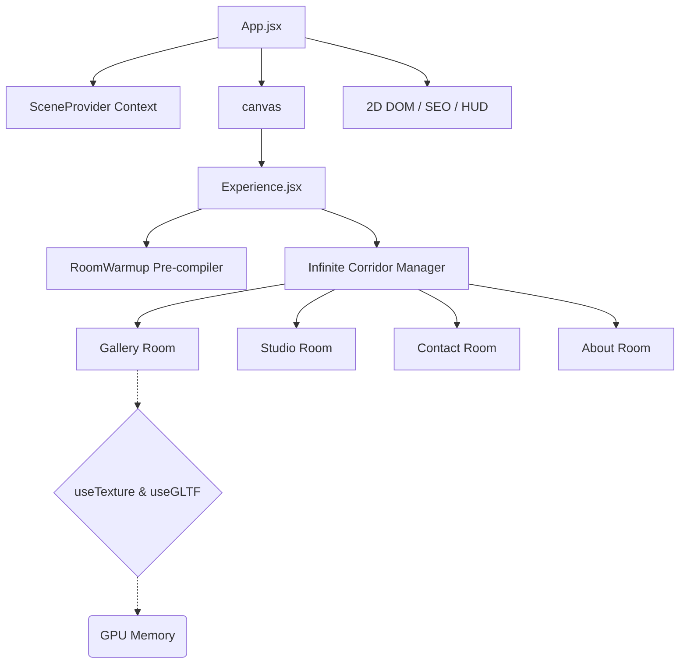

<<<<<<< HEAD
=======
# Saurabh Shirbhate | Interactive 3D WebGL Portfolio

<div align="center">
  
  
  
  
  
</div>

<br/>

This is the interactive 3D Web Developer portfolio of **Saurabh Shirbhate** (Software Developer). The project pushes the limits of modern web technologies by blending spatial WebGL computing, complex React ecosystems, and highly optimized frontend engineering.

> [!NOTE]
> Ensure hardware acceleration is enabled in your browser settings to experience the smooth 60 FPS high-tier rendering of this application.

## Key Performance Architectures (2026 Standards)

This application is strictly optimized for cross-device operability, achieving zero lag spikes even on mobile processors through several bespoke architectural implementations:

1. **Invisible Semantic SEO Fallback:** Bypasses WebGL canvas SEO limitations via strategic `sr-only-seo` indexing DOM injections, rendering fully visible semantic trees to native search-engine crawlers without mounting heavy bundles.
2. **Asynchronous Shader Compilation:** Enforces `gl.compileAsync` during the Preloading phase inside a hidden `RoomWarmup` Suspense boundary. This allows Three.js to pre-compile complex materials asynchronously without blocking the main React update thread.
3. **Baked Global Tinting & Lighting Extraction:** Replaced real-time WebGL shadow maps and infinite light rays with baked-in global textures (`apply_global_tint.js`), dropping the GPU compute overhead entirely while maintaining visual depth.
4. **DOM Mutation Bypassing:** Critical animation properties (like SVG preloader states tracking 130+ concurrent HTTP texture requests) write directly to the `ref.current.style`, intentionally bypassing React's `setState` render cycles to conserve CPU.
5. **Adaptive Device Tiering:** Auto-detects `navigator.deviceMemory`, hardware concurrency, and viewport sizes to scale WebGL resolutions (`dpr`), antialiasing algorithms, and texture loading strictness on the fly.

---

## 3D Scene Architecture



---

## Local Development Setup

To run this application natively on your local machine:

1. **Install dependencies:**
   Make sure you are on Node.js v20+.
   ```bash
   npm install
   ```

2. **Start the local Dev Server:**
   ```bash
   npm run dev
   ```

3. **Production build & preview:**
   ```bash
   npm run build && npm run preview
   ```

> [!IMPORTANT]
> Since this project heavily utilizes `vite-plugin-compression` and hundreds of high-res textures, your initial local load might take a few seconds as the dev-server buffers asset delivery. For performance testing, always run `npm run build && npm run preview`.

## Live Deployment

The production deployment lives at [saurabh-portfolio.pages.dev](https://saurabh-portfolio.pages.dev) (Cloudflare Pages).

- SEO metadata, sitemap, robots.txt and `_headers` are already configured for this domain.
- The contact form requires a `VITE_WEB3FORMS_KEY` environment variable and an entry in `MessagePaper.jsx` `ALLOWED_ORIGINS` matching the deployment domain.

## License

The code in this repository is licensed under the [MIT License](LICENSE), based on the open-source project by Tomasz Szmajda (ITom Dev).
**Note:** The 3D textures, avatar, project artwork, and copywriting remain the original assets from that project and may not be reused or reproduced without explicit permission from their respective authors.
>>>>>>> 84940c6 (first commit)
"# corridor3" 
